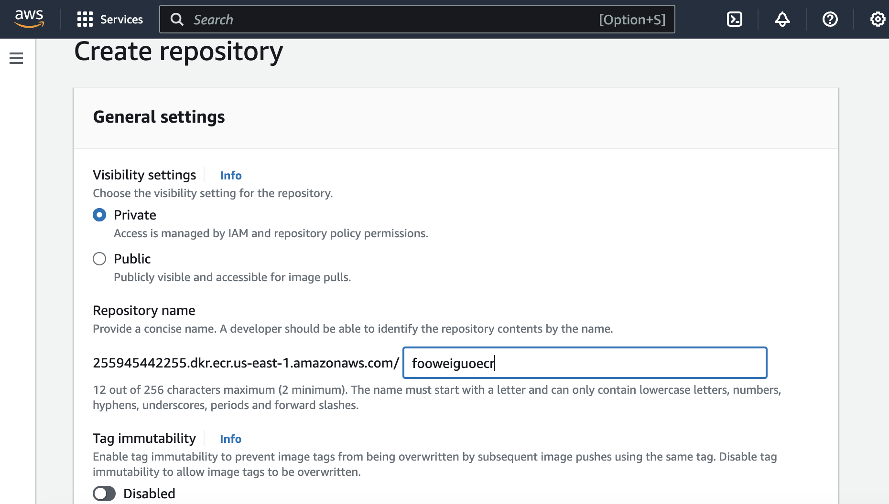

# HOW TO PUSH EVERYTHING TO ECR

## Preliminary
In this example we will be using hello-node application from the repository to
run a node-application and push everything to ECR named "fooweiguoecr". In this
repository the necessary files are already there so just clone everything from
this repository to the local machine. 

To see that the hello-node application is running smoothly, in this current
directory, run

"npm install"

and then type localhost:8080 in the browser. You should be able to see a
website. 

## Creating (private) ECR on console

## Creating Docker Image
Next, we are going to containerise the hello-node application. To do this, we
first run the command "docker build -t <image name> .". But since
the name of the ECR is fooweiguoecr, our image name will be fooweiguoecr. For
instance 

docker build -t fooweiguoecr .

Reminder: do not forget the period at the end! It means to build an image using
the files from the current folder, and name it "fooweiguoecr". 

To see if the image is saved in docker, run "docker images". 

## Pushing images to ECR
To push the image into AWS ECR using AWS CLI, run the following command:

aws ecr get-login-password --region us-east-1 | docker login --username AWS --password-stdin 255945442255.dkr.ecr.us-east-1.amazonaws.com

This will retrieve authentication tocken and authenticate your Docker client to
your registry. If you succeed, you should see "Login Succeeded". 

Afterwards, tag your image so that you can push the image to this repository:

docker tag fooweiguoecr:latest 255945442255.dkr.ecr.us-east-1.amazonaws.com/fooweiguoecr:latest

Once done, you are ready to push the image to the ECR!

docker push 255945442255.dkr.ecr.us-east-1.amazonaws.com/fooweiguoecr:latest
